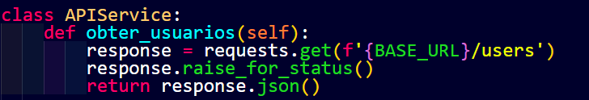
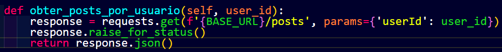
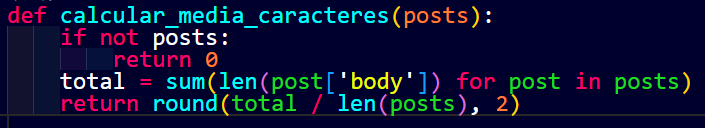
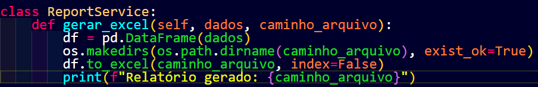
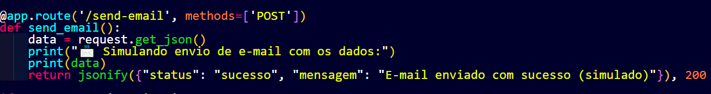

# 📄 Documentação Técnica – Automação de Processos e Dados

## 1. Introdução

Este projeto simula uma automação de processamento de dados a partir da API fictícia JSONPlaceholder. O fluxo inclui:

- Extração de dados de usuários e seus posts.
- Cálculo da média de caracteres dos textos dos posts.
- Geração de um relatório em Excel.
- Simulação do envio desse relatório via um endpoint implementado com Flask.

---

## 2. Detalhes das Operações

### 2.1 Obtenção de Usuários

- **Endpoint:** `https://jsonplaceholder.typicode.com/users`
- **Método:** `GET`
- **Descrição:** Coleta todos os usuários, extraindo `id` e `name`.


### 2.2 Obtenção de Posts por Usuário

- **Endpoint:** `https://jsonplaceholder.typicode.com/posts?userId={id}`
- **Método:** `GET`
- **Descrição:** Coleta os posts associados a cada usuário.


### 2.3 Cálculo da Média de Caracteres

- **Campo analisado:** `body` de cada post.
- **Lógica:** Soma-se o número de caracteres de todos os textos e divide-se pela quantidade total de posts.


### 2.4 Geração de Relatório

- **Formato:** `.xlsx`
- **Bibliotecas:** `pandas`, `openpyxl`
- **Colunas do relatório:**
  - ID do Usuário
  - Nome do Usuário
  - Quantidade de Posts
  - Média de Caracteres dos Posts
- **Arquivo gerado:** `relatorio.xlsx`


### 2.5 Simulação de Envio do Relatório

- **Endpoint simulado:** `POST /send-email`
- **Framework:** Flask
- **Descrição:** O endpoint `/send-email`, criado com Flask, simula o recebimento de um arquivo de relatório. O backend imprime uma mensagem de sucesso ou erro no terminal para representar a operação.

---

## 3. Ferramentas e Configurações

- **Linguagem:** Python 3.11
- **Principais bibliotecas:**
  - `requests`
  - `pandas`
  - `openpyxl`
  - `flask`
  - `unittest`
- **Organização do Projeto:**

```yaml
PROJETO_AUTOMACAO/
├── main.py
├── server.py ← servidor Flask com o endpoint /send-email
├── requirements.txt
├── services/
│ ├── api.py
│ ├── automacao.py
│ ├── email.py
│ └── report.py
├── utils/
│ └── helpers.py
└── tests/
├── test_api_mock.py
└── test_helpers.py
```
---

## 4. Problemas e Soluções

- **Dados inconsistentes ou incompletos:** Verificação de integridade dos dados antes do uso.
- **Usuários sem posts:** Tratamento de divisão por zero (retorna `0` ou `None`).
- **Simulação do envio:** Utilização de um servidor Flask local para simular o endpoint `/send-email`, validando o recebimento do arquivo.

---

## 5. Conclusão

O projeto atende aos objetivos propostos, com foco em boas práticas, clareza de fluxo e modularização do código. Todas as etapas — consumo de dados, cálculo, geração de relatório e simulação de envio com Flask — foram realizadas com sucesso.

---

